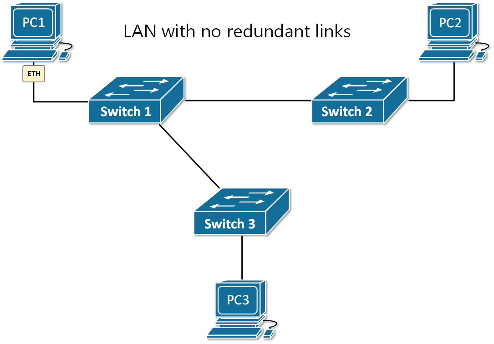
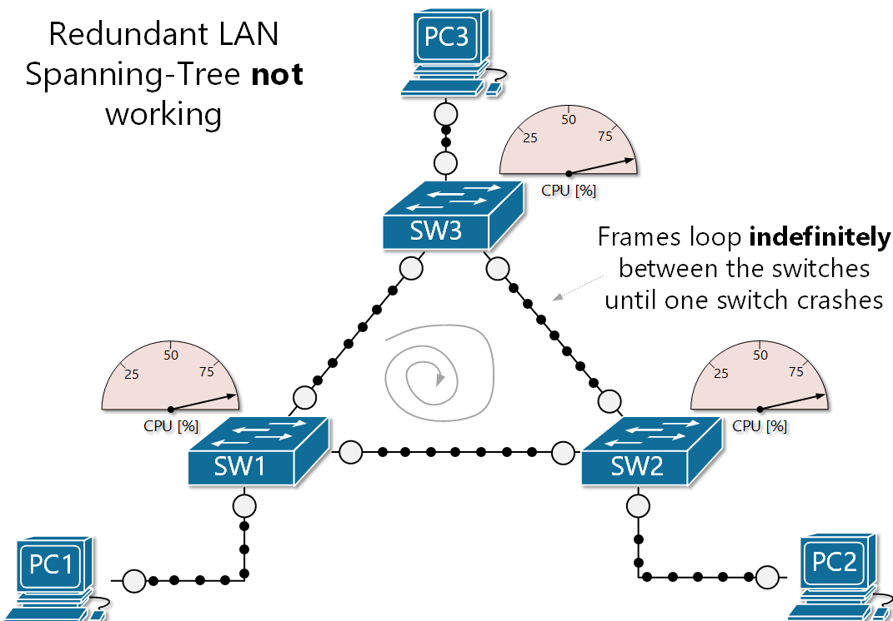
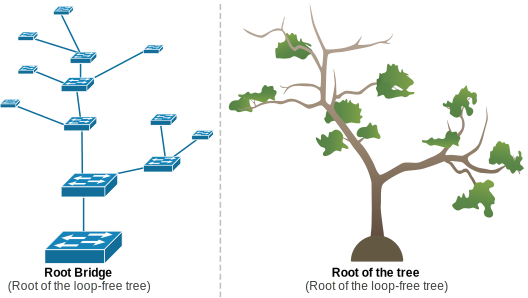

# S02-I129-Advanced Switching and Security

**Module :** ETML – Module 129  
**Auteur :** Alexis Gugler  
**Création :** 31.07.2025  
**Version :** 1 du 31.07.2025  
**Durée estimée de lecture :** XXXXXX minutes

---

# Table des matières

1. Introduction
2. Switchs avancés
   - Switch administrable vs non-administrable
   - Stacking (empilage de switchs)
   - Autosens (auto-MDI/MDIX)
   - Spanning Tree Protocol (STP)
   - Gestion des VLANs (rappel)
   - Exemples de configuration de base
3. Table ARP et ARP

---
# Table des matières (suite)
4. Sécurité des équipements réseau
   - Risques liés aux mots de passe par défaut
   - Accès à distance : Telnet vs SSH
   - ARP poisoning (attaque Man-in-the-Middle)
   - Conseils de sécurisation de base
   - Exemples de commandes de sécurisation
   - Network Access Control (NAC)
     - Qu'est-ce que le NAC ?
     - À quoi sert le NAC ?
     - Comment fonctionne le NAC ?
     - Exemples de solutions NAC
     - Schéma simplifié
     - Points clés à retenir
5. Exercices pratiques

---

# 1. Introduction

Ce chapitre aborde les notions avancées liées aux switchs et à la sécurité réseau. Vous découvrirez les fonctionnalités avancées des switchs, les risques de sécurité courants et les bonnes pratiques pour sécuriser un réseau local.

---

# 2. Switchs avancés

Les switchs modernes offrent de nombreuses fonctionnalités avancées pour améliorer la performance, la gestion et la sécurité des réseaux.

---

## 2.1 Switch administrable vs non-administrable

- **Switch non-administrable** : Plug & play, aucune configuration possible, usage domestique ou petits réseaux.
- **Switch administrable** : Permet la configuration (VLAN, QoS, sécurité, monitoring), accès via interface web/CLI/SNMP, utilisé en entreprise.

> **Switch layer 2** : opère au niveau de la couche liaison de données (OSI), gère les adresses MAC et le trafic local.
> **Switch layer 3** : opère au niveau de la couche réseau (OSI), capable de faire du routage entre sous-réseaux et/ou VLAN. 
---

## 2.2 Stacking (empilage de switchs)

- Permet de relier plusieurs switchs pour qu'ils fonctionnent comme un seul appareil logique.
- Avantages : gestion centralisée, redondance, augmentation du nombre de ports.
- Exemple : Cisco StackWise.


*Source : [Cisco - StackWise](https://www.cisco.com/c/en/us/products/collateral/switches/catalyst-9000/nb-06-cat-9k-stack-wp-cte-en.html)*

---

## 2.3 Autosens (auto-MDI/MDIX)

### Qu'est-ce que l'auto-MDI/MDIX ?

- MDI (Medium Dependent Interface) et MDI-X (MDI crossover) sont deux types de modes de fonctionnement des ports Ethernet.
- Traditionnellement, il fallait utiliser un câble droit ou croisé selon le type de connexion (PC ↔ switch, switch ↔ switch).
- L'auto-MDI/MDIX est une fonction qui permet au port de détecter automatiquement le type de câble et d'ajuster la connexion en conséquence.

---

### À quoi sert l'auto-MDI/MDIX ?

- Permet d'utiliser n'importe quel câble Ethernet (droit ou croisé) pour relier des équipements réseau.
- Évite les erreurs de câblage et simplifie l'installation.
- Pratique pour les environnements où le type de câble n'est pas toujours connu.

---

### Pourquoi utilise-t-on l'auto-MDI/MDIX ?

| Sans auto-MDI/MDIX | Avec auto-MDI/MDIX |
|--------------------|--------------------|
| Nécessite de choisir le bon câble (droit ou croisé) selon les équipements connectés | N'importe quel câble fonctionne |
| Risque d'erreur de câblage | Installation simplifiée |
| Plus de maintenance et de vérification | Moins d'interventions nécessaires |

- L'auto-MDI/MDIX améliore la flexibilité et la fiabilité du réseau, surtout lors de modifications ou d'ajouts d'équipements.

---

### Est-ce encore utilisé aujourd'hui ?

- L'auto-MDI/MDIX est aujourd'hui intégré par défaut sur la majorité des équipements réseau modernes (switchs, routeurs, cartes réseau).
- Il n'est plus nécessaire de se soucier du type de câble à utiliser dans la plupart des cas.
- Les anciens équipements ou certains matériels très basiques peuvent encore nécessiter un choix de câble, mais c'est devenu rare.
- En résumé : l'auto-MDI/MDIX est devenu un standard et facilite grandement le déploiement des réseaux actuels.

---

### Activation et configuration de l'auto-MDI/MDIX

- Lorsque la fonction auto-MDIX est activée, le type de câble utilisé n'a pas d'importance. L'interface s'adapte automatiquement pour assurer la communication.
- Sur les routeurs et commutateurs Cisco récents, la commande du mode de configuration d'interface `mdix auto` permet d'activer cette fonctionnalité.
  ```
  mdix auto
  ```
- Depuis les commutateurs Cisco Catalyst 2960 et 3560 (et supérieur), l'auto-MDI/MDIX est activé par défaut.
- Cette fonctionnalité n'est pas disponible sur les anciens modèles Catalyst 2950 et 3550.

*Source : [CCNA Course - Auto-MDIX](https://cisco.ofppt.info/ccna2/course/module2/2.1.2.3/2.1.2.3.html)*

---

## 2.4 Spanning Tree Protocol (STP)

### Qu'est-ce qu'une boucle de commutation ?

- Une boucle de commutation (switching loop) se produit lorsqu'il existe plusieurs chemins physiques redondants entre les switchs d'un réseau.
- Les trames Ethernet peuvent circuler indéfiniment, provoquant des tempêtes de broadcast, une saturation du réseau et des dysfonctionnements.
- Les boucles sont dangereuses car elles peuvent rendre le réseau inutilisable en quelques secondes.
- Exemple : deux switchs reliés par deux câbles créent une boucle si aucun mécanisme de contrôle n'est en place.
  
[Youtube Video - STP](https://www.youtube.com/watch?v=6MW5P6Ci7lw)

---

### Qu'est-ce que le Spanning Tree Protocol (STP) ?

- Le Spanning Tree Protocol (STP) est un protocole réseau de niveau 2 (couche liaison de données OSI).
- Il permet d'éviter les boucles de commutation dans les réseaux Ethernet comportant des liens redondants.
- STP désactive automatiquement certains ports pour garantir qu'il n'existe qu'un seul chemin actif entre deux équipements.

---

### Pourquoi utilise-t-on le STP ?

- Les boucles réseau peuvent provoquer des tempêtes de broadcast, des saturations et des pannes du réseau.
- Le STP permet d'assurer la redondance (tolérance de panne) tout en évitant ces boucles.
- Il garantit la stabilité et la disponibilité du réseau même en cas de défaillance d'un lien.


*Source : [Network Academy](https://www.networkacademy.io/ccna/spanning-tree/why-do-we-need-stp)*

---

### Pourquoi utilise-t-on le STP ?



---

### Pourquoi utilise-t-on le STP ?




---

### Comment fonctionne le STP ?

- Élection d'un switch racine (root bridge).
- Calcul du chemin le plus court vers le switch racine pour chaque switch.
- Mise en blocage (state blocking) des ports redondants pour éviter les boucles.
- Si un lien principal tombe, un port bloqué est activé pour rétablir la connectivité.
- Variantes : RSTP (Rapid STP), MSTP (Multiple STP).

---

### Pourquoi le nom "Spanning Tree" ?

- Le nom "Spanning Tree" fait référence à la structure d'un arbre (tree) qui ne forme jamais de boucle.
- Comme les branches d'un arbre, chaque chemin part du tronc (root) et se divise sans jamais revenir en arrière, assurant un flux unique et hiérarchique.
- STP construit un réseau sans boucle, à l'image d'un arbre dont les branches ne se rejoignent jamais.

---

### L'analogie entre STP et un arbre

- Le protocole élit un switch racine (Root Bridge), puis construit une structure hiérarchique en désactivant temporairement les chemins redondants.
- Cela crée un chemin unique et sans boucle pour les trames, empêchant leur circulation infinie.



---

### Les 5 étapes du fonctionnement du STP

1. **Élection du Root Bridge (pont racine)** :
   - Tous les switches échangent leurs Bridge ID (identifiant unique composé de la priorité et de l'adresse MAC).
   - Le switch ayant le Bridge ID le plus bas devient le Root Bridge (racine de l'arbre).

2. **Sélection des Root Ports (RP) sur chaque switch non-racine** :
   - Chaque switch calcule le coût du chemin (path cost) le plus faible pour atteindre le Root Bridge.
   - Le port avec le coût total le plus bas devient le Root Port (RP) et reste en état "forwarding" (transmission).

---

### Les 5 étapes du fonctionnement du STP (suite)

3. **Sélection des Designated Ports (DP) sur chaque segment** :
   - Pour chaque segment réseau (collision domain), le switch ayant le chemin le plus court vers le Root Bridge désigne un port comme Designated Port (DP).
   - Ce port sera en état "forwarding" pour transmettre le trafic sur ce segment.

4. **Blocage des Non-Designated Ports (NDP)** :
   - Tout port qui n'est ni Root Port ni Designated Port est mis en état "blocking" (bloqué) pour éviter les boucles.
   - Ces ports ne transmettent pas de trafic utilisateur tant que la topologie ne change pas.


---

### Les 5 étapes du fonctionnement du STP (suite)

5. **Surveillance et recalcul en cas de défaillance** :
   - Si un lien ou un switch tombe, STP détecte le changement de topologie.
   - Il recalcule l'arbre, et un port précédemment bloqué peut passer en "forwarding" pour rétablir la connectivité.

*Termes clés : Root Bridge, Root Port (RP), Designated Port (DP), Non-Designated Port (NDP), path cost, forwarding, blocking.*

*Source : [NetworkAcademy.io - The Spanning Tree Algorithm](https://www.networkacademy.io/ccna/spanning-tree/the-spanning-tree-algorithm)*

---

### Est-ce encore utilisé aujourd'hui ?

- Oui, le STP (ou ses variantes comme RSTP/MSTP) est toujours utilisé dans les réseaux Ethernet modernes.
- Il est indispensable dans les topologies avec redondance pour éviter les boucles.
- Les réseaux d'entreprise, datacenters et campus utilisent STP ou RSTP.

---

### Est-ce activé par défaut ?

- Sur la plupart des switchs administrables, le STP (ou RSTP) est activé par défaut.
- Il est recommandé de le laisser activé sauf cas très particulier.
- Sur Cisco Catalyst, RSTP (mode PVST+) est généralement activé par défaut.

*Source : [Cisco - Spanning Tree Protocol](https://www.cisco.com/c/en/us/td/docs/routers/access/3200/software/wireless/SpanningTree.html)*

---

## 2.5 Gestion des VLANs

### Qu'est-ce qu'un VLAN ?

- Un VLAN (Virtual Local Area Network) est un réseau local virtuel.
- Il permet de regrouper des équipements sur des réseaux logiques distincts, même s'ils sont physiquement connectés au même switch.
- Chaque VLAN correspond à un domaine de broadcast séparé.

---

### Pourquoi utilise-t-on les VLANs ?

- Pour segmenter le réseau et isoler les groupes d'utilisateurs ou de services (ex : administration, étudiants, invités).
- Pour améliorer la sécurité en limitant la portée des communications.
- Pour optimiser le trafic réseau et réduire les broadcasts inutiles.
- Pour faciliter la gestion et l'organisation du réseau.

---

### Comment fonctionnent les VLANs ?

- Chaque port du switch peut être affecté à un VLAN spécifique.
- Les équipements d'un même VLAN peuvent communiquer entre eux, mais pas avec ceux d'un autre VLAN (sauf via un routeur ou un switch layer 3).
- Les trames Ethernet sont marquées avec un identifiant VLAN (802.1Q tagging) lorsqu'elles traversent des liens "trunk" entre switches.

---

### Exemple de configuration de VLAN sur Cisco Packet Tracer

- Accès au switch :
  ```
  enable
  configure terminal
  ```
- Création d’un VLAN :
  ```
  vlan 10
  name Comptabilite
  exit
  ```
- Affectation d’un port à un VLAN :
  ```
  interface FastEthernet0/1
  switchport mode access
  switchport access vlan 10
  exit
  ```

---

### Exemple de configuration de VLAN sur Cisco Packet Tracer (suite)

- Vérification de la configuration :
  ```
  show vlan brief
  ```

---

### Qu'est-ce qu'un Trunk ?

- Un "trunk" est un port de switch configuré pour transporter le trafic de plusieurs VLANs simultanément.
- Il permet de faire transiter les trames de plusieurs VLANs entre deux switches ou entre un switch et un routeur.
- Les trames sont marquées avec un identifiant VLAN (tag 802.1Q) pour indiquer à quel VLAN elles appartiennent.
- Les liens trunk sont essentiels pour l'interconnexion de switches dans un réseau multi-VLAN.

---

### Exemple de configuration d'un trunk sur Cisco Packet Tracer

- Accès à l'interface du port à configurer en trunk :
  ```
  interface FastEthernet0/24
  switchport mode trunk
  switchport trunk allowed vlan 10,20,30
  exit
  ```
- Vérification de la configuration :
  ```
  show interfaces trunk
  ```
- Cette configuration permet au port FastEthernet0/24 de transporter le trafic des VLANs 10, 20 et 30.

---

# 3. Table ARP et ARP

### Qu'est-ce que l'ARP ?

- ARP (Address Resolution Protocol) est un protocole de couche 2/3 qui permet de faire le lien entre une adresse IP (couche 3) et une adresse MAC (couche 2).
- Il est utilisé pour permettre la communication sur un réseau local Ethernet.

---

### À quoi sert l'ARP ?

- Lorsqu'un appareil veut communiquer avec une adresse IP sur le même réseau, il utilise ARP pour découvrir l'adresse MAC correspondante.
- Exemple : un PC veut envoyer un paquet à 192.168.1.10, il demande via ARP "Qui a 192.168.1.10 ? Donne-moi ton adresse MAC".

---

### Comment fonctionne l'ARP ?

- L'appareil envoie une requête ARP (ARP Request) en broadcast sur le réseau.
- L'appareil possédant l'adresse IP répond avec une ARP Reply contenant son adresse MAC.
- Le résultat est stocké dans la table ARP de l'appareil demandeur.

---

### La table ARP

- La table ARP est une mémoire temporaire qui associe les adresses IP aux adresses MAC connues sur le réseau local.
- Elle permet d'accélérer les communications futures sans refaire une requête ARP à chaque fois.
- Commandes utiles :
  - Windows : `arp -a`
  - Cisco : `show arp`

---

### La table MAC dans un Switch est une table ARP ? 
**NON , ou du moins pas pour les switchs de niveau 2 (Layer 2).**
- Les switchs de niveau 2 (Layer 2) n'utilisent pas la table ARP : ils se basent uniquement sur les adresses MAC pour transférer les trames.
- La table ARP est utilisée par les équipements de niveau 3 (routeurs, PC, serveurs) pour faire le lien entre IP et MAC.
- Un switch administrable de niveau 3 (Layer 3) peut, lui, posséder une table ARP car il gère aussi le routage IP.
- En résumé :
  - Switch L2 → Table MAC (adresse MAC uniquement)
  - Switch L3/routeur/PC → Table ARP (IP <-> MAC)

---

# 4. Sécurité des équipements réseau

La sécurité des switchs et routeurs est essentielle pour protéger le réseau contre les attaques et les erreurs de configuration.

---

## 4.1 Risques liés aux mots de passe par défaut

- Les mots de passe par défaut sont souvent connus publiquement.
- Risque d’accès non autorisé si non changés.
- Bonnes pratiques : changer tous les mots de passe par défaut dès la mise en service.

---

## 4.2 Accès à distance : Telnet vs SSH

- **Telnet** : communication en clair, non sécurisé, à éviter.
- **SSH** : communication chiffrée, recommandé pour l’administration à distance.

---

## 4.3 ARP poisoning (attaque Man-in-the-Middle)

- L’attaquant envoie de fausses réponses ARP pour détourner le trafic réseau.
- Conséquences : interception, modification ou blocage du trafic.
- Protection : sécuriser les accès, surveiller les tables ARP, utiliser des outils de détection.

---

## 4.4 Port Security (sécurité des ports sur switch)

- La fonctionnalité **Port Security** permet de contrôler quels appareils peuvent se connecter à chaque port d'un switch, en se basant sur les adresses MAC.
- Elle permet de :
  - Limiter le nombre d'adresses MAC apprises dynamiquement sur un port.
  - Autoriser uniquement certaines adresses MAC (MAC whitelisting).
  - Bloquer ou désactiver un port si une adresse MAC non autorisée est détectée.
- Utilité :
  - Empêcher le branchement non autorisé d'appareils sur le réseau.
  - Limiter les risques d'attaques de type "rogue device" ou usurpation d'identité (MAC spoofing).

---

## 4.5 Conseils de sécurisation de base

- Désactiver les ports inutilisés.
- Utiliser des mots de passe forts et uniques.
- Restreindre l’accès aux interfaces d’administration.
- Utiliser SSH et non Telnet.
- Mettre à jour le firmware des équipements.

---

## 4.6 Network Access Control (NAC)

### Qu'est-ce que le NAC ?

- Le Network Access Control (NAC) est un ensemble de solutions permettant de contrôler qui peut accéder au réseau et sous quelles conditions.
- Il vérifie l'identité, la conformité et l'état de santé des appareils avant d'autoriser l'accès.

---

### À quoi sert le NAC ?

- Empêcher les appareils non autorisés ou non conformes d'accéder au réseau.
- Appliquer des politiques de sécurité selon le profil de l'utilisateur, l'appareil ou l'emplacement.
- Protéger le réseau contre les menaces internes (BYOD, invités, appareils compromis).

---

### Comment fonctionne le NAC ?

- Authentification de l'utilisateur et/ou de l'appareil (ex : 802.1X, portail captif).
- Vérification de la conformité (antivirus, mises à jour, configuration).
- Attribution dynamique de droits d'accès (VLAN, Internet uniquement, accès restreint).
- Surveillance continue et réaction en cas de non-conformité (mise en quarantaine, blocage).

---

### Focus : Qu'est-ce que 802.1X ?

- **802.1X** est une norme de l'IEEE qui permet de contrôler l'accès au réseau (filaire ou Wi-Fi) via une authentification forte.
- Fonctionnement :
  - Lorsqu'un appareil (PC, smartphone, etc.) se connecte à un port du switch ou à un réseau Wi-Fi, il doit s'authentifier auprès d'un serveur (généralement RADIUS).
  - Tant que l'authentification n'est pas réussie, l'accès au réseau est bloqué.
  - Si l'authentification réussit, l'accès est accordé selon la politique définie (accès complet, restreint, VLAN spécifique, etc.).
- 802.1X est très utilisé dans les entreprises, écoles et environnements sensibles pour éviter les connexions non autorisées.

---

### Focus : Qu'est-ce que 802.1X ? (suite)
- Schéma simplifié :
  1. L'utilisateur branche son PC sur le réseau.
  2. Le switch demande une authentification (login/mot de passe, certificat, etc.).
  3. Le serveur d'authentification (RADIUS) valide l'identité.
  4. Si OK, le port est ouvert et l'accès réseau est autorisé.

---

### Exemples de solutions NAC

- Cisco ISE (Identity Services Engine)
- Aruba ClearPass
- FortiNAC
- Solutions open source : PacketFence

---

### Exemple de fonctionnement d'un NAC (schéma simplifié)

1. L'appareil se connecte au réseau (filaire ou Wi-Fi).
2. Le switch ou le contrôleur Wi-Fi demande une authentification (ex : 802.1X).
3. Le serveur NAC vérifie l'identité et la conformité de l'appareil.
4. Si tout est conforme, l'accès est accordé selon la politique définie.
5. Sinon, l'accès est restreint ou refusé.

---

### Points clés à retenir

- Le NAC est essentiel dans les environnements d'entreprise modernes (BYOD, télétravail, sécurité accrue).
- Il complète les autres mesures de sécurité réseau (VLAN, port security, firewall).
- Sa mise en œuvre nécessite une bonne planification et une gestion centralisée des politiques d'accès.

*Source : [Cisco - What is Network Access Control (NAC)?](https://www.cisco.com/site/us/en/learn/topics/security/what-is-network-access-control-nac.html)*

---

# 5. Exercice pratique

Effectuez l'ex : "**E-129-Ex02-VLAN-STP.pdf**" 


---
# Questions ?

Merci pour votre attention !

Des questions ?

Est-ce que la sécurité vous int

