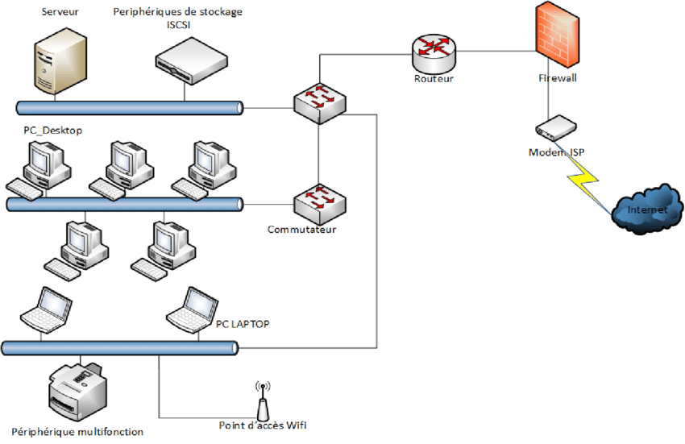

# S04-I129-Analyse des besoins et préparation du réseau

**Module :** ETML – Module 129  
**Auteur :** Alexis Gugler  
**Création :** 02.08.2025  
**Version :** 1 du 02.08.2025  
**Durée estimée de lecture :** XX minutes

---

# Table des matières

1. Introduction
2. Analyse des besoins réseau
   - Lecture et compréhension d’un cahier des charges
   - Identification des contraintes et objectifs
3. Identification des composants réseau
   - Switchs, routeurs, câblage, autres équipements
   - Critères de choix

---

# Table des matières (suite)

4. Schématisation du réseau
   - Règles de base pour un schéma réseau
   - Outils de schématisation (draw.io, Visio etc.)
   - Exemples de schémas simples
5. Exercice pratique
   - schématiser un réseau à partir d’un scénario (draw.io ou visio)
   - Produire ce schéma sur Packet Tracer

---

# 1. Introduction

Cette séquence porte sur l’analyse des besoins d’un client, la préparation et la schématisation d’un réseau local.  
Vous apprendrez à lire un cahier des charges, identifier les composants nécessaires et réaliser un schéma réseau simple.

---

# 2. Analyse des besoins réseau

## 2.1 Lecture et compréhension d’un cahier des charges

- Un cahier des charges décrit les attentes, contraintes et objectifs du client.
- Il précise : le nombre d’utilisateurs, les services attendus, la sécurité, la performance, le budget, etc.
- Exemple d’extrait :
  > "Le réseau doit permettre à 30 postes de travail d’accéder à Internet et à une imprimante partagée. Un accès Wi-Fi invité doit être prévu. Les données sensibles doivent être isolées."

---

## 2.2 Identification des contraintes et objectifs

- Contraintes techniques : locaux, distances, nombre de prises réseau, débit, etc.
- Contraintes organisationnelles : horaires, accès invités, sécurité.
- Objectifs : fiabilité, évolutivité, simplicité de gestion, coût.

---

# 3. Identification des composants réseau

## 3.1 Switchs, routeurs, câblage, autres équipements

- **Switchs** : relient les équipements d’un même réseau local.
- **Routeurs** : assurent la communication entre réseaux différents (ex : LAN ↔ Internet).
- **Points d’accès Wi-Fi** : pour la mobilité et les invités.
- **Câblage** : cuivre (Ethernet), fibre optique selon les besoins.
- **Baie de brassage, onduleur, etc.** : pour l’organisation et la sécurité électrique.

---

## 3.2 Critères de choix

- Nombre de ports nécessaires (actuels et futurs)
- Débit (Fast Ethernet, Gigabit, 10GbE…)
- Fonctions avancées (VLAN, PoE, administration…)
- Budget et évolutivité
- Compatibilité avec l’existant

---

# 4. Schématisation du réseau

## 4.1 Règles de base pour un schéma réseau

- Représenter clairement tous les équipements et leurs connexions.
- Utiliser des symboles standards (PC, switch, routeur, etc.).
- Indiquer les noms/logiques des VLANs ou sous-réseaux si besoin.
- Préciser les liaisons importantes (uplink, trunk, etc.).

---

## 4.2 Outils de schématisation (draw.io, Visio etc.)

- **draw.io** : création de schémas statiques.
- **Visio** : outil professionnel de schématisation.
- **Cisco Packet Tracer** : simulation réseau.
- Autres outils selon les préférences.

---

## 4.3 Exemples de schémas simples

*Source : [Architecture du réseau existant (ResearchGate)](https://www.researchgate.net/figure/Architecture-du-reseau-existant-13-Explication-technique-du-reseau-Larchitecture-du_fig1_351123585)*

---

# 5. Exercice pratique

## 5.1 Schématiser un réseau à partir d’un scénario (draw.io ou visio)

1. Lisez le scénario fourni par l’enseignant (nombre de postes, besoins, contraintes).
2. Listez les composants nécessaires.
3. Réalisez un schéma réseau clair sur draw.io ou Visio.
4. Vérifiez que le schéma répond bien à tous les besoins du cahier des charges.

---

## 5.2 Produire ce schéma sur Packet Tracer

- Reproduisez le schéma réalisé sur draw.io ou Visio dans Cisco Packet Tracer.
- Vérifiez la cohérence des connexions et la correspondance avec le cahier des charges.
- Sauvegardez le fichier Packet Tracer pour remise.

---

## Questions de réflexion

- Quels sont les points critiques à anticiper lors de la préparation d’un réseau ?
- Pourquoi est-il important de bien schématiser avant de configurer ?
- Quels avantages à utiliser un outil de simulation comme Packet Tracer ?

---

*Source : supports ETML, Cisco Networking Academy, documentation Packet Tracer*