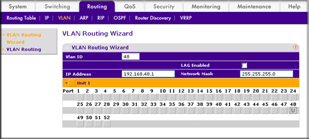
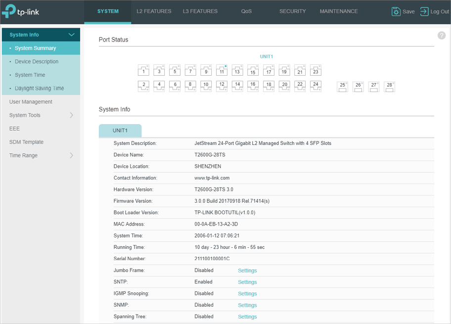
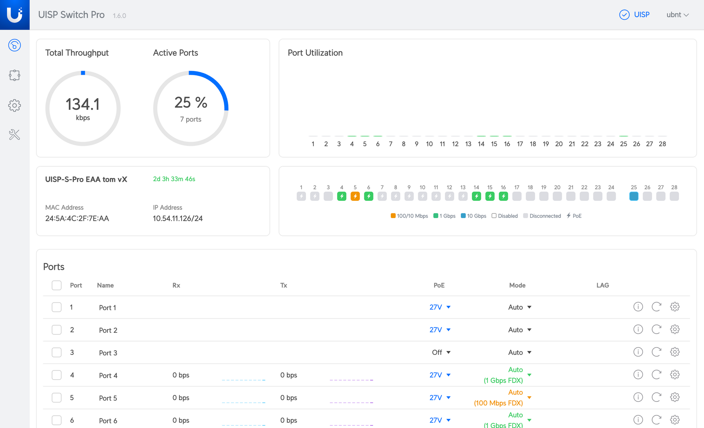

# S05-I129-Configuration des équipements réseau

**Module :** ETML – Module 129  
**Auteur :** Alexis Gugler  
**Création :** 05.08.2025  
**Version :** 1 du 05.08.2025  
**Durée estimée de lecture :** XX minutes

---

# Table des matières

1. Introduction
2. Interfaces de configuration
   - CLI (Command Line Interface)
   - Interface Web
3. Configuration de base
   - Hostname
   - Interfaces réseau
   - Adresse IP
4. Pratique - P_Res 129

---

# 1. Introduction

Cette séquence aborde la configuration de base des équipements réseau (switchs, routeurs) à l’aide des interfaces CLI et Web. Vous apprendrez à configurer les paramètres essentiels pour mettre en service un équipement dans un réseau local.

---

# 2. Interfaces de configuration

## 2.1 CLI (Command Line Interface)

- Interface textuelle accessible via console, SSH ou Telnet.
- Permet un contrôle précis et avancé de l’équipement.
- Exemple d’accès à la CLI sur Packet Tracer :
  - Onglet "CLI" sur l’équipement
  - Commandes de base : `enable`, `configure terminal`, etc.

---

## 2.2 Interface Web

- Interface graphique accessible via navigateur web (si activée sur l’équipement).
- Plus intuitive pour les débutants.
- Permet de configurer les paramètres de base et parfois avancés.

---

## 2.3 netgear web UI



---

## 2.4 tplink web UI



---

## 2.5 Ubiquiti web UI




---

## 2.6 Ubiquiti Unifi web UI


---

# 3. Configuration de base Cisco (Packet Tracer)

## 3.1 Définir le nom de l’équipement (hostname) [Cisco]

```shell
Switch> enable
Switch# configure terminal
Switch(config)# hostname SW-ETML
SW-ETML(config)#
```

---

## 3.2 Configurer les interfaces réseau [Cisco]

- Accéder à l’interface :

  ```shell
  SW-ETML(config)# interface FastEthernet0/1
  SW-ETML(config-if)#
  ```

- Activer l’interface :

  ```shell
  SW-ETML(config-if)# no shutdown
  ```

- Désactiver l’interface :

  ```shell
  SW-ETML(config-if)# shutdown
  ```

- Sortir de l’interface :

  ```shell
  SW-ETML(config-if)# exit
  ```

---

## 3.3 Configurer une adresse IP sur un routeur [Cisco]

```shell
Router> enable
Router# configure terminal
Router(config)# interface GigabitEthernet0/0
Router(config-if)# ip address 192.168.1.1 255.255.255.0
Router(config-if)# no shutdown
Router(config-if)# exit
```

- Vérifier la configuration de l’interface :

```shell
Router# show ip interface brief
```

- Sauvegarder la configuration :

```shell
Router# write memory
```


---

## Questions de réflexion

- Pourquoi est-il important de nommer correctement les équipements via une convention de nommage ?
- Quelle différence entre la configuration via CLI et via interface Web ?
- Quels sont les risques si une interface réseau reste désactivée ?

---

# 4. Pratique - P_Res 129

Avancez sur le projet P_RES-129 afin de pratiquer. 


---

*Sources : Cisco, supports ETML, Netgear, TP-Link, Ubiquiti
