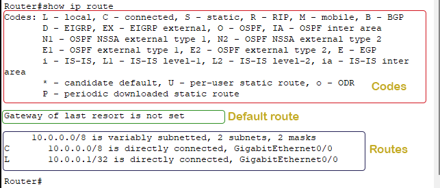
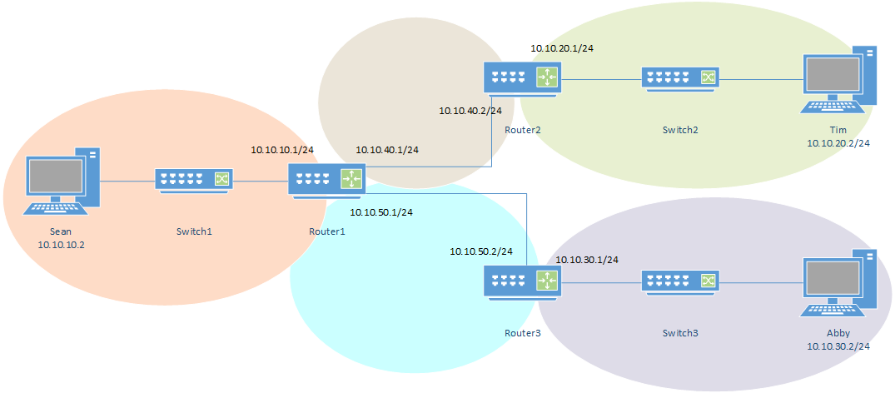
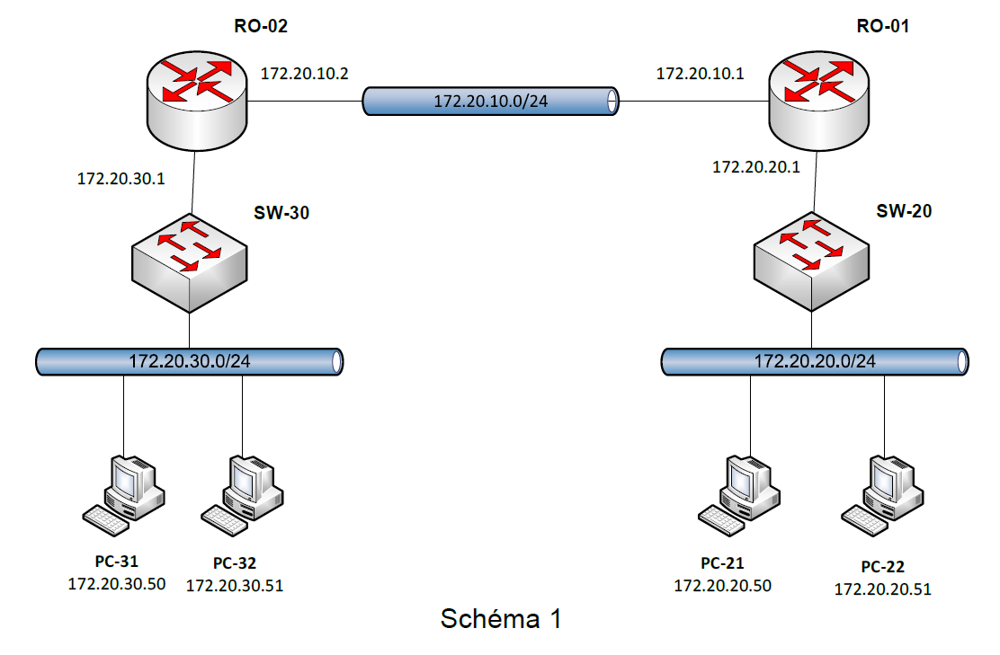

# S06-I129-Routage statique

**Module :** ETML – Module 129  
**Auteur :** Alexis Gugler  
**Création :** 05.08.2025  
**Version :** 2 du 30.09.2025  
**Durée estimée de lecture :** XX minutes

---

# Table des matières

1. Introduction
2. Routage statique
3. Routage dynamique
4. Structure et contenu des tables de routage
5. Exercice pratique : implémenter le routage statique sur Packet Tracer

---

# 1. Introduction au routage

## 1.1 Le routage, c'est quoi ?

- Le routage est le processus qui permet de faire transiter des paquets de données d’un réseau à un autre, en choisissant le meilleur chemin possible.
- Il est assuré par des équipements appelés routeurs.
- Sans routage, les communications seraient limitées à un seul réseau local (LAN).

---

## 1.2 Pourquoi utilise-t-on du routage ?

- Pour permettre la communication entre plusieurs réseaux distincts (ex : entre un réseau d’entreprise et Internet).
- Pour contrôler le trafic entre différents réseau et sous-réseaux (subnets)
- Pour améliorer la sécurité, la performance et la gestion du réseau.

---

## 1.3 Quels sont les types de routage ?

- **Routage statique** : les routes sont configurées manuellement par l’administrateur.
- **Routage dynamique** : les routes sont apprises automatiquement via des protocoles d’échange entre routeurs.

---

## 1.4 Différences entre routage statique et routage dynamique

| Routage statique | Routage dynamique |
|------------------|------------------|
| Routes saisies manuellement | Routes apprises automatiquement |
| Simple à mettre en place | Plus complexe à configurer |
| Adapté aux petits réseaux | Adapté aux grands réseaux évolutifs |
| Pas d’adaptation automatique en cas de panne | S’adapte aux changements de topologie |
| Moins de ressources nécessaires | Utilise plus de ressources (CPU, mémoire, bande passante) |

---

# 2. Routage statique

- Les routes sont configurées manuellement par l’administrateur.
- Adapté aux petits réseaux ou aux topologies stables.
- Simplicité, contrôle total, mais peu flexible.
- Nécessite une intervention humaine en cas de modification du réseau.
- **Avantages** : maîtrise, sécurité, pas de trafic de protocoles de routage.
- **Inconvénients** : risque d’erreur humaine, pas d’adaptation automatique.

---

# 3. Routage dynamique

- Les routes sont apprises automatiquement via des protocoles (RIP, OSPF, EIGRP…)
- Adapté aux réseaux de grande taille ou évolutifs.
- Les routeurs échangent des informations pour découvrir et maintenir les routes.
- **Avantages** : adaptation automatique, gestion simplifiée des grands réseaux.
- **Inconvénients** : complexité, consommation de ressources, risques de boucles si mal configuré.

---

## 3.1 RIP 
- **RIP (Routing Information Protocol)** est un protocole de routage dynamique simple.
- Il utilise un algorithme de distance pour déterminer le meilleur chemin.
- Il est basé sur le nombre de sauts (hops) pour évaluer la distance.
- **Avantages** : facile à configurer, adapté aux petits réseaux.
- **Inconvénients** : limité à 15 sauts, pas adapté aux grands réseaux

---

## 3.2 OSPF
- **OSPF (Open Shortest Path First)** est un protocole de routage dynamique plus avancé.
- Il utilise un algorithme de lien d’état pour construire une carte du réseau.
- Il est capable de gérer des réseaux de grande taille et complexes.
- **Avantages** : évolutif, rapide à converger, supporte les sous-réseaux de différentes tailles.
- **Inconvénients** : plus complexe à configurer, nécessite plus de ressources.
- **OSPF** est souvent préféré dans les environnements professionnels pour sa robustesse et sa flexibilité.

---

## 3.2.1 Qu'est-ce qu'un algorithme de lien d'état ?

- Un algorithme de lien d’état (link-state) est une méthode utilisée par certains protocoles de routage dynamique (comme OSPF) pour déterminer le meilleur chemin dans un réseau.
- Chaque routeur construit une carte complète de la topologie du réseau en échangeant des informations avec ses voisins.
- Les routeurs calculent ensuite le chemin le plus court vers chaque destination à l’aide de l’algorithme de Dijkstra.
- **Avantages** :
  - Convergence rapide (mise à jour rapide en cas de changement de topologie)
  - Connaissance globale du réseau
  - Meilleure optimisation des routes

---

## 3.3 EIGRP
- **EIGRP (Enhanced Interior Gateway Routing Protocol)** est un protocole de routage dynamique développé par Cisco.
- Il combine les avantages de RIP et OSPF.
- Il utilise un algorithme de distance et de lien d’état.
- **Avantages** : rapide, évolutif, supporte les réseaux complexes.
- **Inconvénients** : propriétaire (Cisco), plus complexe à configurer que RIP.
- **EIGRP** est souvent utilisé dans les réseaux Cisco pour sa rapidité et sa capacité à gérer des topologies complexes.

---


# 4. Structure et contenu des tables de routage

- Une table de routage contient l’ensemble des routes connues par un routeur.
- Chaque entrée indique :
  - Le réseau de destination
  - Le masque de sous-réseau
  - La passerelle (next hop)
  - L’interface de sortie
  - Le type de route (statique, dynamique)

- Exemple de commande pour afficher la table de routage sur Cisco :

```shell
Router# show ip route
```

---

## Exemple de résultat de la commande `show ip route`



---
## Exemple de résultat de la commande `show ip route` (suite)

L’affichage de la commande `show ip route` est organisé en trois sections principales :

- **Codes** : Cette section affiche la signification de chaque code abrégé utilisé dans la table de routage (ex : C = connected, S = static, R = RIP, O = OSPF, etc.). Ici, le code **C** signifie qu’il s’agit d’un réseau directement connecté à une interface du routeur (c’est-à-dire physiquement relié et activé).
- **Default route** : Cette section affiche la route par défaut (si elle existe). Si aucune route ne correspond à la destination d’un paquet, le routeur utilise la route par défaut pour le transmettre. Si aucune route par défaut n’est définie, le paquet est supprimé.

---
## Exemple de résultat de la commande `show ip route` (suite)


- **Routes** : Toutes les routes connues sont listées ici. Les routes sont regroupées par réseau classful si plusieurs sous-réseaux existent pour un même réseau. Si un seul sous-réseau existe, il est affiché sans regroupement.


*Source de l’image et des explications : [ComputerNetworkingNotes - The show ip route command explained](https://www.computernetworkingnotes.com/ccna-study-guide/the-show-ip-route-command-explained.html)*

---
# 4. Exercice pratique : Cisco Packet Tracer

- Objectif : permettre la communication entre les deux réseaux via des routes statiques.




---
# 4. Exercice pratique : implémenter le routage statique sur Packet Tracer

- Objectif : permettre la communication entre les deux réseaux via des routes statiques.




---


*Sources : Cisco, supports ETML, documentation Packet Tracer*
https://www.computernetworkingnotes.com/ccna-study-guide/the-show-ip-route-command-explained.html
